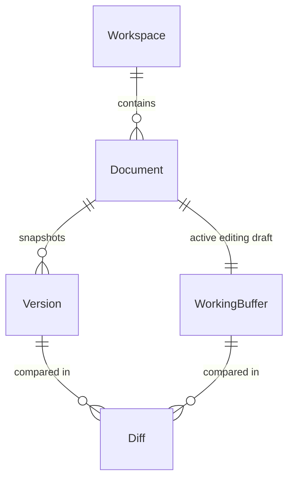

# TextDiff 核心交互架构与 UX 重构方案

## 1. 核心定位与领域模型 (Domain Model)

### 1.1 核心用户任务重塑
TextDiff 的核心价值不是泛泛的 “代码片段管理 (Snippet)” 或单一的 “Markdown 预览”，而是面向开发者的 **动态文本资产版本化工作台 (Versioned Text Workspace for Developers)**：
> **“高效记录、修改、追溯和对比开发过程中频繁变化的文本资产（SQL、YAML、JSON、Nacos 配置、Shell、Docker 配置等）。”**

### 1.2 统一领域实体语言 (Ubiquitous Language)
彻底淘汰弱化演进概念的 `Snippet`，确立 4 个一等公民核心概念：



1. **Workspace (工作区)**：
   - 文本资产的项目/环境分组容器（例如按微服务 `order-service`、环境 `prod-nacos`、或通用 `sql-patches` 划分）。
   - 默认预置 `Default Workspace`，无需强迫前置创建即可开箱即用。
2. **Document (文档)**：
   - 承载文本资产的实体，具备明确业务含义。包含标题、文件名/扩展名、语法语言标识、更新时间以及当前的 Working Buffer（实时草稿）。
3. **Version (版本)**：
   - 确定性的历史快照。递增版本号（`v1`, `v2`, ...）、不可变内容镜像、创建时间、提交备注（Commit Note）。
4. **Diff (对比)**：
   - 一等公民的操作与比对视图。提供两类对比场景：
     - **实时草稿对比**：Working Buffer vs 最近已存版本（Unsaved changes diff）。
     - **历史任意版本对比**：Version A vs Version B（或某一历史版本 vs 当前草稿）。

---

## 2. 信息架构 (Information Architecture)

```
TextDiff Workbench (工作台)
├── 1. Left Explorer (侧边导航栏 - 可折叠)
│   ├── Workspace Selector (顶部工作区切换器: 当前工作区下拉 + 新建)
│   ├── Quick Filter & Search (文档快速搜索 + 语言过滤 Pills)
│   └── Document List (文档列表: 标题、语言图标、最新版本号如 v3、未存改动小圆点、更新时间)
│
├── 2. Center Stage (主工作台画布)
│   ├── Stage Header (工作台顶部控制栏)
│   │   ├── Left: Document Identity (文档标题输入、文件后缀输入、语言选择器)
│   │   ├── Center: Version & Dirty Status (版本徽章，如 "v3 · 3 uncommitted changes" 或 "v3 (saved)")
│   │   └── Right: Primary Actions
│   │       ├── Mode Switcher: [Edit | Diff (+3 -1)] (当前草稿与最近版本的主视图切换)
│   │       ├── Primary Action: [Save Version] (Cmd+S / 保存新快照)
│   │       ├── History Entry: [History (N)] (触发右侧版本抽屉)
│   │       └── Overflow Menu: [···] / Cmd+K (格式化、复制、Markdown渲染、主题等次要功能)
│   ├── Main Canvas (主编辑/对比舞台)
│   │   ├── Edit Canvas: Monaco Editor (极简无扰全屏代码编辑)
│   │   └── Diff Canvas: Monaco Diff Editor (Split / Unified 模式，支持跳转改动块)
│   └── Floating Diff Inspector Bar (当处于历史两版本比对状态时吸顶展示)
│       └── "Comparing v2 (10:00) ↔ v4 (14:30) | [Restore v2 to Draft] [Exit Diff]"
│
└── 3. Slide-over Version Drawer (右侧版本历史抽屉)
    ├── Version Timeline (从新到旧垂直时间线)
    ├── Version Item Card:
    │   ├── Version Badge (v3, v2, v1)
    │   ├── Commit Note / Summary
    │   ├── Timestamp & Diff stats
    │   └── Quick Actions:
    │       ├── Compare with Current (一键将此版本与当前草稿对比)
    │       ├── Select for Diff (复选框，选满 2 个立即触发对比)
    │       └── Restore to Draft (安全将此版本内容无损载入编辑器草稿)
    └── Compare Action Bar (当选中两个版本时底部浮现：[Compare vA ↔ vB])
```

---

## 3. 核心工作流与交互模型 (Interaction Models)

### 3.1 核心流一：创建与实时编辑 (Create & Edit)
1. 点击侧边栏 `+ New Document`，在当前 Workspace 内快速生成新文档。
2. 自动聚焦文档标题与 Monaco Editor，支持直接粘贴文本或输入文件名识别语法（如 `schema.sql`、`application.yml`）。
3. **安全防丢**：编辑过程触发静默自动保存（Working Buffer 存入本地草稿），顶部状态显示 `● Uncommitted changes`。

### 3.2 核心流二：固化版本快照 (Save Version Workflow)
1. 触发方式：按键盘快捷键 `Cmd/Ctrl + S` 或点击顶部主操作按钮 `[Save Version]`。
2. 交互体验：**拒绝全屏遮挡阻断式 Modal**。
   - 在顶部 Header 下方无缝滑出一个极轻量的内联输入条（Inline Prompt Bar）：“Version Note (optional)... [Enter to Snapshot] [Esc to cancel]”。
   - 若用户直接回车，即以默认递增版本号（如 `v2`）和当前时间戳生成快照。
3. 状态转化：版本号更新为 `v2 (Saved)`，未保存小红点消失，时间线自动追加新快照节点。

### 3.3 核心流三：即时差异比对 (Compare Workflow)

#### 场景 A：当前修改对比（工作草稿 vs 最近版本）
- 用户在编辑过程中，顶部控制栏的 `[Diff]` 标签实时显示改动统计（例如 `Diff (+12 -3)`）。
- 点击 `[Diff]` 直接在主舞台无缝切换至 Monaco Diff 视图，无需弹窗，支持并排（Side-by-side）或行内（Unified）查看本次未保存修改。
- 再次点击 `[Edit]` 立即切回编辑模式继续调整。

#### 场景 B：历史版本对比（任意两版本）
- 点击 `[History (N)]` 展开右侧抽屉。
- 用户可在任意版本项上点击 `Compare with Current`，或勾选两个版本（如 `v1` 与 `v3`）。
- 主画布立即进入 Diff 模式，并在画布顶端出现高对比度的 **Sticky Compare Bar**：
  `Comparing v1 (2026-09-15 10:00) ↔ v3 (2026-09-15 11:20)  |  [Restore v1 to Draft]  [✕ Exit Diff]`
- 开发者可清晰比对改动，点击 `Exit Diff` 随时退回原先的编辑草稿。

### 3.4 核心流四：安全回滚 (Restore Workflow)
- 当用户在历史时间线或对比控制条中点击 `[Restore / 恢复此版本]`：
- **安全暂存策略 (Safe Rollback to Draft)**：
  - 将该历史版本的全文覆盖载入当前的 Working Buffer。
  - 标记为 `Uncommitted edits (Restored from vX)`。
  - **不直接修改既有版本历史，不产生强制覆盖破坏**。
  - 开发者可以在编辑器中检查回滚后的代码，验证无误后，再次按 `Cmd+S` 提交为新版本（如 `v4: Restored from v2`）。

---

## 4. 视觉层级与开发者工具调性 (Visual Hierarchy & Developer Tooling)

1. **主次分明**：
   - 界面视觉重力严格分配给：**编辑区 (70%) > 状态与主要操作条 (15%) > 导航 (15%)**。
   - 移除花哨的 AI SaaS 式渐变大按钮、大卡片或过度装饰的卡片间距。采用精炼的 1px 细边框（border-canvas-border）、暗色系高对比度排版、等宽代码字体（Geist Mono / Fira Code）。
2. **次要功能收敛**：
   - 主 Header 绝不堆砌格式化、Markdown 预览、主题切换、代码复制等非核心高频按钮。
   - 统统收纳进 `···` 下拉菜单与 `Cmd + K` 全局命令面板中，保证主工作区心流不受干扰。
